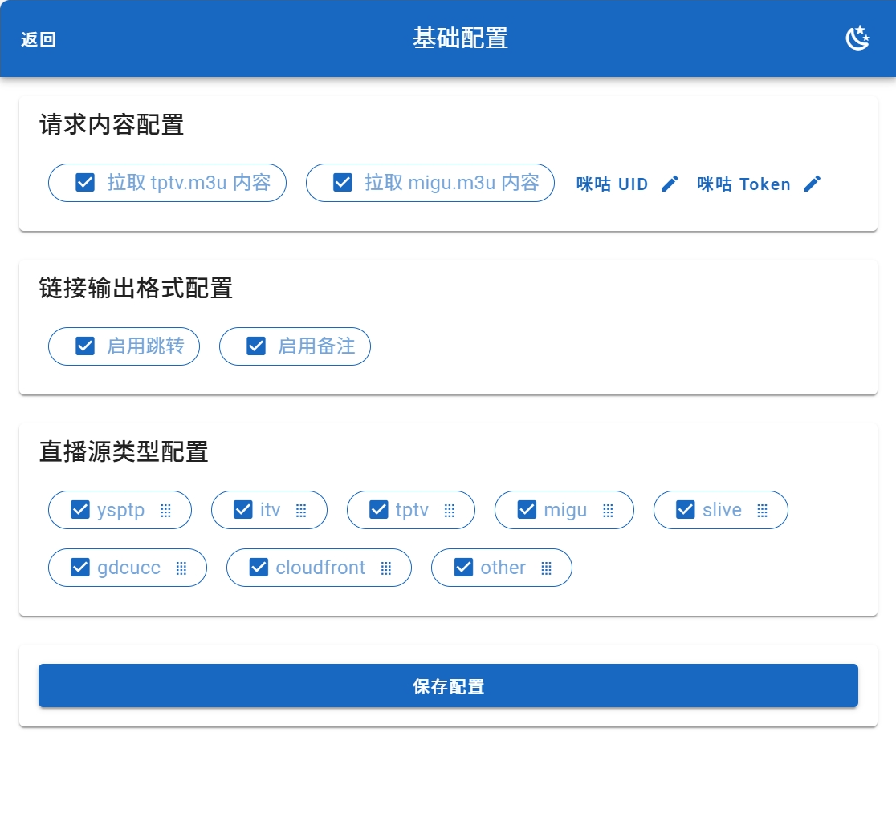
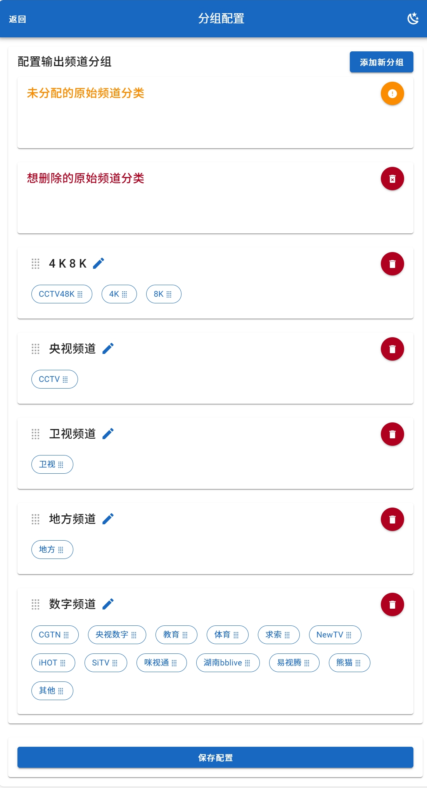
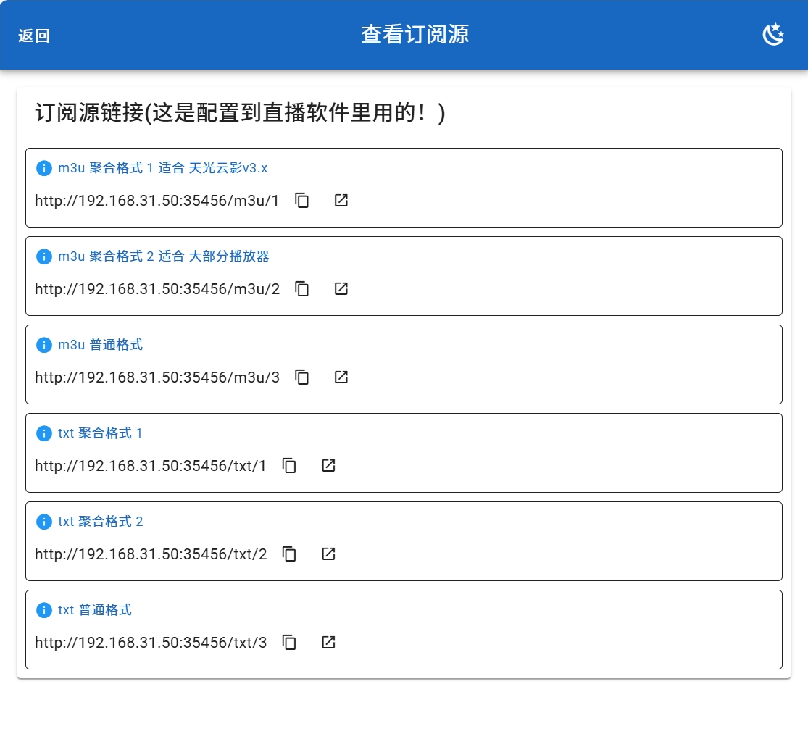

## 功能简介：
本项目是对 [youshandefeiyang/allinone](https://hub.docker.com/r/youshandefeiyang/allinone) /tv.m3u、/tptv.m3u、/migu.m3u 进行聚合 & 重新分组。

## 前置项目
请先安装此项目 [youshandefeiyang/allinone](https://hub.docker.com/r/youshandefeiyang/allinone)

## 多直播源合并工具
- 如果你需要将多个直播源或者huya、douyu 啥的合并到一起，那就用这个项目
- [https://github.com/taksssss/EPG-Server](https://github.com/taksssss/EPG-Server)
- [https://hub.docker.com/r/taksss/php-epg](https://hub.docker.com/r/taksss/php-epg)

## 项目源码
[allinone_format](https://github.com/FanchangWang/allinone_format)

## 运行方式：
```shell

##########################
#                        #
#    Docker 运行方式      #
#                        #
##########################

# docker 运行方式
docker run -d --restart=unless-stopped --pull=always -v /etc/allinone_format:/app/config -p 35456:35456 --name allinone_format yuexuangu/allinone_format:latest

# openwrt 等系统可能需要 --net=host 网络的，请使用以下命令：
docker run -d --restart=unless-stopped --pull=always --net=host -v /etc/allinone_format:/app/config --name allinone_format yuexuangu/allinone_format:latest

##########################
#                        #
#    docker-compose      #
#                        #
##########################
version: '3'
services:
  allinone_format:
    image: yuexuangu/allinone_format:latest
    container_name: allinone_format
    restart: unless-stopped
    pull_policy: always
    network_mode: host # openwrt 等系统可能需要此参数
    ports:
      - 35456:35456
    volumes:
      - /etc/allinone_format:/app/config

##########################
#                        #
#      源码运行方式       #
#                        #
##########################

# 前端
cd frontend && npm install && npm run dev
# 后端
cd server && php -S 127.0.0.1:35456 -t public index.php

```

## 使用教程
- 部署后访问配置页面：http://内网IP:35456/
- 配置 allinone tv.m3u 订阅源。（如果是同 ip 下，会自动探测 http://内网IP:35455/tv.m3u ）
- 复制订阅源链接（三种 m3u 格式, 三种 txt 格式）（可以在浏览器打开查看输出是否正常）
- 在直播软件配置刚才复制的 m3u/txt 订阅源

## 配置管理





## 更新日志
```text
2025-2-16 03:31:36
    - 增加 bptv 识别
    - 优化 卫视 频道识别
    - 移除 rptv ysptp 等废弃分类
    - 移除 tptv.m3u 相关代码

2025-1-16 14:06:23
    - 修复 migu.m3u tvg-id tvg-name 全部为空导致无法解析的问题

2025-1-15 21:18:42
    - fix 前端资源使用相对路径，解决 location /path/ 反代资源报错问题

2025-1-12 14:36:39
    - 新增 支持 rptv 频道
    - 去除 反代模糊匹配 location /path/ , 需要 nginx 重写路径 rewrite ^/path/(.*)$ /$1 break;

2024-12-20 00:36:21
    - 全面兼容反向代理
    - 现在可以直接跟 allinone 使用同一个反代域名，
    - allinone_format 放在 nginx location /path/ 路径下进行反代即可。
    - 比如：
    - allinone 反代：http://内网ip:35455/tv.m3u?url=https://test.com
    - allinone_format 反代域名设置：https://test.com/path
    - allinone_format 反代 配置页面：https://test.com/path/
    - allinone_format 反代 订阅链接：https://test.com/path/m3u/1
    - 优化1 前端静态资源使用相对路径
    - 优化2 前端 api 请求使用相对路径
    - 优化3 后端路由支持模糊匹配

2024-12-17 19:47:07
    - 更改 输出格式 3 时，不进行jump也不带备注
    - 更改 关闭备注时，jump 也自动关闭

2024-12-17 04:52:33
    - 新增 支持反向代理设置
    - 优化 静态资源
    - 去除 前端子页面路由

2024-12-16 00:29:56
    - 新增 高码频道
    - 新增 支持反向代理

2024-12-06 00:00:00
    - 修复 CCTV4 欧洲和美洲 分类到 CGTN

2024-12-05 19:51:05
    - 新增 migu.m3u 订阅源
    - 新增 可以完全删除某些频道分组，不会出现在输出结果中
    - 修复 m3u 输出格式多一个 , 的问题

2024-12-04 22:47:28
    - 优化 配置页面按功能拆分

2024-12-04 15:08:35
    - 修复 无法修改输出频道分组名
    - 修复 保存配置时表单校验失败依然弹出模态框提示

2024-12-03 02:48:55
    - 修复 输出频道分组拖动位置bug
    - 新增 再同 ip/域名 下尝试自动探测 allinone tv.m3u 地址
    - 新增 tv.m3u 订阅源更严格的检测与错误提示
    - 新增 保存配置的时候对 tv.m3u 进行检测
    - 新增 允许某些原始频道分类不进行分组，直接舍弃
    - 修改 请求 tv.m3u curl 改为 tcp 握手 2 秒超时，总体 3 秒超时

2024-12-02 00:09:57
    - 重构项目
    - 新增 配置管理页面
    - 优化 三种 m3u 输出格式 & 三种 txt 输出格式
    - 开关 链接二次跳转或备注
    - 开关 链接类型（比如排除 tptv 链接）
    - 自由配置链接分组（可以自己重新设定频道分组）
旧日志：
    请查看 deprecated/Readme.md
```
