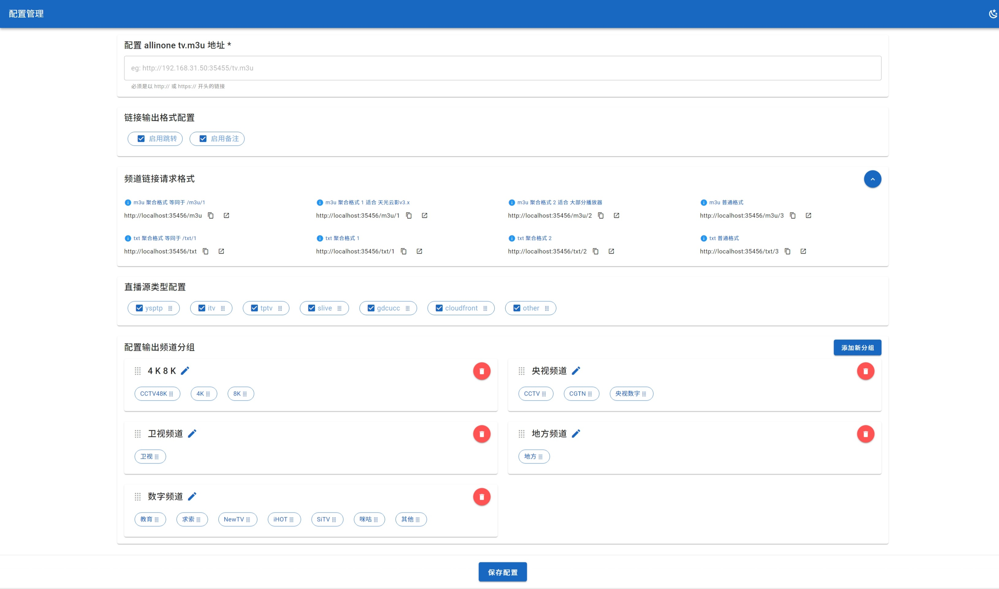

## 功能简介：
本项目是对 [youshandefeiyang/allinone](https://hub.docker.com/r/youshandefeiyang/allinone) /tv.m3u 和 /tptv.m3u 进行聚合 & 重新分组。

## 前置项目
请先安装此项目 [youshandefeiyang/allinone](https://hub.docker.com/r/youshandefeiyang/allinone)

## 项目源码
[allinone_format](https://github.com/FanchangWang/allinone_format)

## 运行方式：
```shell

##########################
#                        #
#    Docker 运行方式      #
#                        #
##########################

# docker 运行方式

# 将 /path/to/config/ 改为你的配置文件存放目录
docker run -d --restart=unless-stopped --pull=always -v /path/to/config/:/app/config/ -p 35456:35456 --name allinone_format yuexuangu/allinone_format:latest

# openwrt 等系统可能需要 --net=host 网络的，请使用以下命令：
docker run -d --restart=unless-stopped --pull=always --net=host -v /path/to/config/:/app/config/ -p 35456:35456 --name allinone_format yuexuangu/allinone_format:latest

##########################
#                        #
#    docker-compose      #
#                        #
##########################
version: '3'
services:
  allinone_format:
    image: yuexuangu/allinone_format:latest
    container_name: allinone_format
    restart: unless-stopped
    pull_policy: always
    network_mode: host # openwrt 等系统可能需要此参数
    volumes:
      - /path/to/config/:/app/config/ # 请将 /path/to/config/ 改为你的配置文件存放目录

##########################
#                        #
#      源码运行方式       #
#                        #
##########################

# 前端
cd frontend && npm install && npm run dev
# 后端
cd server && php -S 0.0.0.0:35456 index.php

```

## 使用教程
- 部署后访问配置页面：http://内网IP:35456/
- 配置 allinone tv.m3u 订阅源。（如果是同 ip 下，会自动探测 http://内网IP:35455/tv.m3u ）
- 复制订阅源链接（三种 m3u 格式, 三种 txt 格式）（可以在浏览器打开查看输出是否正常）
- 在直播软件配置刚才复制的 m3u/txt 订阅源

## 配置管理


## 更新日志
```text
2024-12-05 19:51:05
    - 新增 migu.m3u 订阅源
    - 新增 可以完全删除某些频道分组，不会出现在输出结果中
    - 修复 m3u 输出格式多一个 , 的问题

2024-12-04 22:47:28
    - 优化 配置页面按功能拆分

2024-12-04 15:08:35
    - 修复 无法修改输出频道分组名
    - 修复 保存配置时表单校验失败依然弹出模态框提示

2024-12-03 02:48:55
    - 修复 输出频道分组拖动位置bug
    - 新增 再同 ip/域名 下尝试自动探测 allinone tv.m3u 地址
    - 新增 tv.m3u 订阅源更严格的检测与错误提示
    - 新增 保存配置的时候对 tv.m3u 进行检测
    - 新增 允许某些原始频道分类不进行分组，直接舍弃
    - 修改 请求 tv.m3u curl 改为 tcp 握手 2 秒超时，总体 3 秒超时

2024-12-02 00:09:57
    - 重构项目
    - 新增 配置管理页面
    - 优化 三种 m3u 输出格式 & 三种 txt 输出格式
    - 开关 链接二次跳转或备注
    - 开关 链接类型（比如排除 tptv 链接）
    - 自由配置链接分组（可以自己重新设定频道分组）
旧日志：
    请查看 deprecated/Readme.md
```
